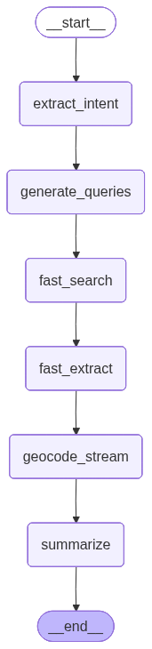
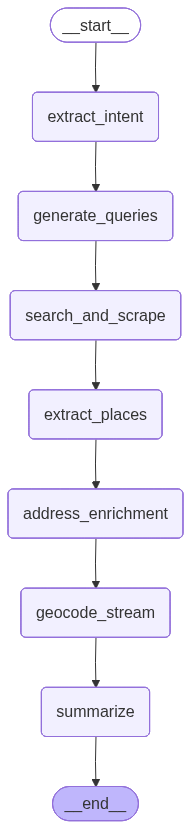

<p align="center">
  

</p>

<h1 align="center">Geo Chat</h1>


<p align="center">
  <strong>AI-Powered Geospatial Assistant with Real-Time Web Data</strong>
</p>

<p align="center">
  <a href="#-highlights">Highlights</a> &bull;
  <a href="#-demo">Demo</a> &bull;
  <a href="#-architecture">Architecture</a> &bull;
  <a href="#-getting-started">Getting Started</a> &bull;
  <a href="#-features">Features</a> &bull;
  <a href="#-tech-stack">Tech Stack</a>
</p>

<p align="center">
  <a href="https://geo-chat-beta.vercel.app/">
    
  </a>
  &nbsp;&nbsp;
  <a href="https://brightdata.com/">
    
  </a>
</p>

---

## What is Geo Chat?

Geo Chat is an open-source demonstration of how to build intelligent geospatial applications using [Bright Data's MCP (Model Context Protocol)](https://brightdata.com/) for real-time web data access. Ask natural language questions like *"Find the best Italian restaurants in Tel Aviv"* or *"Show me coworking spaces near Central Park"*, and watch as the AI searches the web, extracts structured data, geocodes locations, and displays them on an interactive map—all in seconds

This project showcases the power of combining:
- **Real-time web scraping** via Bright Data's infrastructure
- **LLM-powered intelligence** for understanding queries and extracting data
- **Geospatial visualization** for intuitive map-based results

---

## Highlights

- **Natural Language Interface** — Ask questions in plain English; no complex query syntax required
- **Real-Time Web Data** — Searches TripAdvisor, Yelp, Google Maps, and more via Bright Data MCP
- **Dual Pipeline Modes** — Fast mode for quick results; Deep mode for comprehensive scraping
- **Interactive Maps** — Results displayed on beautiful MapLibre GL maps with clustering
- **Mobile-First Design** — Responsive UI that works seamlessly on desktop and mobile devices
- **LangGraph Architecture** — Modular, observable AI pipeline with streaming updates
- **Open Source** — Fully transparent codebase to learn from and build upon

---

## Demo

### Example Queries

| Query | What Happens |
|-------|--------------|
| *"Find 5 coffee shops in San Francisco"* | Searches Yelp, TripAdvisor for coffee shops, geocodes addresses, displays on map |
| *"Best rated hotels near Times Square NYC"* | Finds hotels with ratings, extracts reviews, shows locations |
| *"Coworking spaces in Berlin with good WiFi"* | Intelligent search across multiple sources with filtering |
| *"Italian restaurants in London with outdoor seating"* | Extracts specific amenities from scraped pages |

---

## Architecture

Geo Chat uses a **LangGraph-based pipeline** architecture that processes queries through a series of intelligent nodes. The application offers two pipeline modes:

### Fast Pipeline (Default)
Optimized for speed (~2-3 seconds). Extracts place data directly from search snippets without full page scraping

<p align="center">
  
</p>

### Deep Pipeline
Comprehensive data extraction (~10-15 seconds). Scrapes full page content for richer details including reviews, hours, and amenities.

<p align="center">
  
</p>

### Pipeline Nodes

| Node | Fast Pipeline | Deep Pipeline | Description |
|------|---------------|---------------|-------------|
| **extract_intent** | ✓ | ✓ | Parse natural language, identify place types, location, filters |
| **generate_queries** | ✓ | ✓ | Generate optimized search queries for TripAdvisor, Yelp, Google Maps |
| **fast_search** | ✓ | — | Parallel search, extract from snippets |
| **search_and_scrape** | — | ✓ | Search + scrape full page content via Bright Data MCP |
| **fast_extract** | ✓ | — | LLM extracts places from search snippets |
| **extract_places** | — | ✓ | LLM parses scraped content for detailed place info |
| **address_enrichment** | — | ✓ | Enhance incomplete addresses |
| **geocode_stream** | ✓ | ✓ | Deduplicate places, geocode via Google Maps API |
| **summarize** | ✓ | ✓ | Generate natural language response with recommendations |

### Why Bright Data MCP?

The **Model Context Protocol (MCP)** from Bright Data provides:

| Capability | Benefit |
|------------|---------|
| **Web Search API** | Search Google, Bing with structured results |
| **Web Scraping** | Extract content from any website at scale |
| **Proxy Infrastructure** | Reliable access to geo-restricted content |
| **Anti-Bot Handling** | Automatic CAPTCHA solving and fingerprint management |
| **Structured Data** | Clean JSON output ready for LLM processing |

This eliminates the complexity of building and maintaining scraping infrastructure, letting you focus on building intelligent applications.

---

## Getting Started

### Prerequisites

- **Node.js** 18+
- **npm** or **yarn**
- **Bright Data Account** — [Sign up for free credits](https://brightdata.com/)
- **Google Cloud Account** — For Maps API (geocoding) and Gemini LLM

### Installation

1. **Clone the repository**
   ```bash
   git clone https://github.com/anthropics/geo-chat.git
   cd geo-chat
   ```

2. **Install dependencies**
   ```bash
   # Backend
   cd backend
   npm install

   # Frontend
   cd ../frontend
   npm install
   ```

3. **Configure environment variables**

   Create `backend/.env`:
   ```env
   # Bright Data MCP
   BRIGHTDATA_API_TOKEN=your_brightdata_api_token

   # Google AI (Gemini)
   GEMINI_API_KEY=your_gemini_api_key

   # Google Maps (for geocoding)
   GOOGLE_MAPS_API_KEY=your_google_maps_api_key

   # Server
   PORT=3001
   ```

   Create `frontend/.env`:
   ```env
   VITE_API_URL=http://localhost:3001
   ```

4. **Start the development servers**
   ```bash
   # Terminal 1: Backend
   cd backend
   npm run dev

   # Terminal 2: Frontend
   cd frontend
   npm run dev
   ```

5. **Open the app**

   Navigate to `http://localhost:5173`

---

## Features

### Fast Mode vs Deep Mode

| Feature | Fast Mode | Deep Mode |
|---------|-----------|-----------|
| **Speed** | 2-3 seconds | 10-15 seconds |
| **Data Source** | Search snippets | Full page scraping |
| **Detail Level** | Basic info | Rich details (reviews, hours, etc.) |
| **Best For** | Quick lookups | Comprehensive research |

### Mobile Experience

Geo Chat features a mobile-optimized interface with:
- Floating chat overlay on the map
- Touch-friendly markers and controls
- Safe area support for notched devices
- Responsive layout that adapts to any screen size

### Intelligent Deduplication

The geocoding pipeline automatically:
- Normalizes place names
- Removes duplicate entries
- Filters irrelevant results based on location context

---

## Tech Stack

### Backend
| Technology | Purpose |
|------------|---------|
| **Express.js** | API server |
| **LangGraph** | AI pipeline orchestration |
| **LangChain** | LLM integration |
| **Bright Data MCP** | Web search and scraping |
| **Google Gemini** | Language model |
| **Google Maps API** | Geocoding |
| **TypeScript** | Type safety |

### Frontend
| Technology | Purpose |
|------------|---------|
| **React 19** | UI framework |
| **MapLibre GL** | Map rendering |
| **Tailwind CSS** | Styling |
| **Vite** | Build tool |
| **TypeScript** | Type safety |

---

## Project Structure

```
geo-chat/
├── backend/
│   ├── src/
│   │   ├── index.ts              # Express server entry
│   │   ├── routes/
│   │   │   └── chat.ts           # Chat streaming endpoint
│   │   ├── services/
│   │   │   ├── langgraph/        # LangGraph pipeline
│   │   │   │   ├── nodes/        # Pipeline nodes
│   │   │   │   │   ├── intentExtraction.ts
│   │   │   │   │   ├── queryGeneration.ts
│   │   │   │   │   ├── fastSearch.ts
│   │   │   │   │   ├── fastExtract.ts
│   │   │   │   │   ├── searchAndScrape.ts
│   │   │   │   │   ├── dataExtraction.ts
│   │   │   │   │   ├── geocoding.ts
│   │   │   │   │   └── summarization.ts
│   │   │   │   ├── fastPipelineGraph.ts
│   │   │   │   └── pipelineGraph.ts
│   │   │   ├── mcp/              # Bright Data MCP client
│   │   │   └── mapbox/           # Geocoding service
│   │   └── types/
│   └── package.json
├── frontend/
│   ├── src/
│   │   ├── App.tsx               # Main app component
│   │   ├── components/
│   │   │   ├── Chat/             # Chat UI components
│   │   │   └── Map/              # Map components
│   │   └── api/
│   │       └── client.ts         # API client
│   └── package.json
└── README.md
```

---

## Environment Variables

| Variable | Required | Description |
|----------|----------|-------------|
| `BRIGHTDATA_API_TOKEN` | Yes | Your Bright Data API token |
| `GEMINI_API_KEY` | Yes | Google AI API key for Gemini LLM |
| `GOOGLE_MAPS_API_KEY` | Yes | Google Maps API key for geocoding |
| `PORT` | No | Backend server port (default: 3001) |
| `VITE_API_URL` | Yes | Backend API URL for frontend |

---

## Why Build with Bright Data?

### For GIS Professionals

If you work with geospatial data, you know the challenge: **location data is scattered across the web** in countless websites, directories, and platforms. Bright Data MCP gives you:

- **Universal Access** — Scrape any website without building custom parsers
- **Always Fresh Data** — Real-time web access vs stale databases
- **Global Coverage** — Access geo-restricted content from any region
- **Structured Output** — Clean JSON ready for your GIS workflows
- **Scale on Demand** — From prototype to production without infrastructure changes

### Use Cases

| Industry | Application |
|----------|-------------|
| **Real Estate** | Property listings, neighborhood analysis |
| **Retail** | Competitor location intelligence |
| **Logistics** | POI data for route optimization |
| **Urban Planning** | Business density mapping |
| **Tourism** | Attraction and venue discovery |
| **Market Research** | Location-based demographic analysis |

---

## Contributing

Contributions are welcome! Please feel free to submit a Pull Request.

1. Fork the repository.
2. Create your feature branch (`git checkout -b feature/amazing-feature`)
3. Commit your changes (`git commit -m 'Add some amazing feature'`)
4. Push to the branch (`git push origin feature/amazing-feature`)
5. Open a Pull Request

---

## Resources

- [Bright Data Documentation](https://docs.brightdata.com/)
- [Bright Data MCP Guide](https://brightdata.com/products/mcp)
- [LangGraph Documentation](https://langchain-ai.github.io/langgraph/)
- [MapLibre GL JS](https://maplibre.org/)

---

## License

This project is licensed under the MIT License - see the [LICENSE](LICENSE) file for details

---

<p align="center">
  <strong>Built with Bright Data</strong><br>
  <a href="https://brightdata.com/">Get your free API credits</a>
</p>
